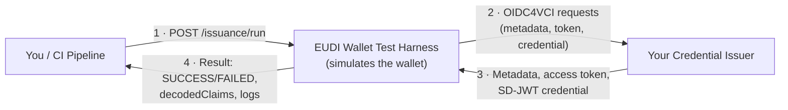
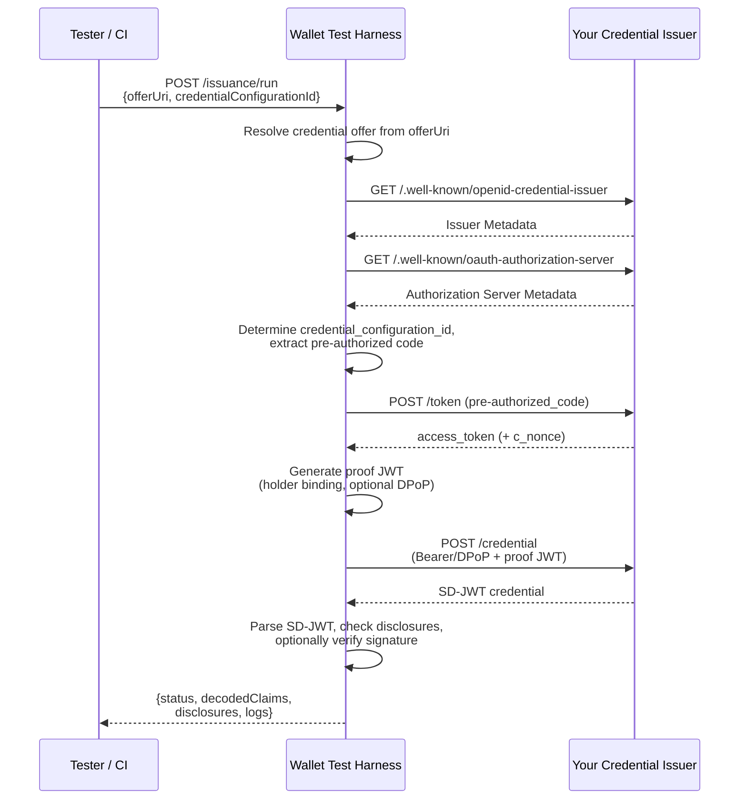

# EUDI Wallet Test Harness

Wallet simulator for testing a credential issuer: plays through the wallet side
of an OpenID4VCI Pre-Authorized Code Flow (SD-JWT VC), including optional DPoP
(RFC 9449) and signature verification (x5c/JWKS) — locally or in CI, without a
real wallet, headless, deterministic. Spring Boot 4, Java 21, Maven.

The harness is intentionally use-case-neutral: it does not prescribe a specific
credential type. `credential-configs.yaml` contains a generic example scenario
(`example_credential`) as a template — which credential type, which claims, and
which `vct` are actually tested is determined by the project operating or testing
the credential issuer.



*In short: you send the harness a credential offer, it plays through a complete
wallet flow with it, and reports back whether your credential issuer responded
correctly.*

## Prerequisites

- The credential issuer to be tested is already running and reachable.
- JDK 21. No separate Maven installation needed — `./mvnw` (Maven Wrapper)
  downloads it automatically on first invocation.
- Alternatively, without a local JDK: Docker (see "Container Deployment").

## Quick Start

```bash
./mvnw spring-boot:run
```

```bash
curl -s http://localhost:8090/actuator/health
# {"status":"UP"}
```

A credential offer is obtained beforehand from the credential issuer (deep link
or `credential_offer_uri` — the exact method is determined by the credential
issuer). To trigger the flow:

```bash
curl -s -X POST http://localhost:8090/issuance/run \
  -H "Content-Type: application/json" \
  -d '{"offerUri": "<credential-offer-deep-link-or-uri>", "credentialConfigurationId": "example_credential"}' \
  | jq .
```

## Reading the Result

```json
{
  "status": "SUCCESS",
  "logs": ["...step-by-step log..."],
  "issuerMetadata": { "...": "..." },
  "tokenResponse": { "access_token": "...", "token_type": "Bearer" },
  "rawSdJwt": "eyJhbGciOi...~WyJzYWx0Ii...~",
  "decodedClaims": { "exampleClaimA": "example-value-a" },
  "disclosures": [ { "claimName": "exampleClaimA", "value": "example-value-a", "digest": "..." } ]
}
```

`status: "SUCCESS"` means: credential offer resolved, token and credential
requests successful, SD-JWT parsed. With `status: "FAILED"`, the error cause is
in `error`, and the trace up to the failure is in `logs`.

## Setting Up a Custom Test Scenario

A scenario in `src/main/resources/config/credential-configs.yaml` defines which
`issuerCredentialConfigurationId`, which `vct`, and which claims a test run
expects. The included `example_credential` is just a template — for a real
credential issuer, define your own scenario there (the format is documented in
the file) or point `CREDENTIAL_CONFIG_PATH` to your own file.

## Configuration

All settings are in `src/main/resources/application.yml` and can be flexibly overridden via environment variables (e.g., for running in Docker containers or CI/CD pipelines):

| Env Var | Property | Purpose |
|---|---|---|
| `HARNESS_PORT` | `server.port` | Harness port (default 8090) |
| `HARNESS_VERIFY_TLS` | `harness.verify-tls` | TLS certificate verification against the credential issuer |
| `CUSTOM_CA_BUNDLE` | `harness.custom-ca-bundle` | Path to a PEM CA bundle |
| `HOST_ALIASES` | — | JSON object for rewriting hostnames, e.g., `{"issuer.example":"localhost:8080"}` — needed because the credential offer usually contains a hostname that is not resolvable from the test context |
| `USE_DPOP` | `harness.use-dpop` | Enable DPoP (RFC 9449) by default |
| `VERIFY_SD_JWT_SIGNATURE` | `harness.verify-sd-jwt-signature` | Verify SD-JWT signature by default (x5c preferred, JWKS fallback) |
| `CREDENTIAL_CONFIG_PATH` | `harness.credential-config-path` | Path to an alternative `credential-configs.yaml` |

`useDpop`/`verifySdJwtSignature` can additionally be overridden per request in
the body of `POST /issuance/run`, without restarting the harness — practical for
testing the same credential issuer at different maturity levels:

```bash
# Early development stage: omit flags
curl -s -X POST http://localhost:8090/issuance/run \
  -H "Content-Type: application/json" -d '{"offerUri": "..."}' | jq .

# Once the credential issuer supports DPoP/x5c:
curl -s -X POST http://localhost:8090/issuance/run \
  -H "Content-Type: application/json" \
  -d '{"offerUri": "...", "useDpop": true, "verifySdJwtSignature": true}' | jq .
```

## API

| Method | Path | Purpose |
|---|---|---|
| GET | `/actuator/health` | Health check (Spring Boot Actuator) |
| GET | `/config/credential-configurations` | Show loaded test scenarios |
| POST | `/issuance/run` | Execute issuance flow against the credential issuer. Body: `offerUri` (required), `credentialConfigurationId`, `txCode`, `useDpop`, `verifySdJwtSignature` (all optional) |

## Flow per `POST /issuance/run`



1. Resolve credential offer from `offerUri` (inline `credential_offer` or
   load via `credential_offer_uri`).
2. Load issuer metadata (`/.well-known/openid-credential-issuer`) and
   authorization server metadata (`/.well-known/oauth-authorization-server` or
   `/.well-known/openid-configuration`).
3. Determine `credential_configuration_id` (override from the request or the
   first ID supported by the credential issuer from the offer).
4. Extract pre-authorized code grant from the offer.
5. Token request (optionally with DPoP proof including nonce retry per RFC 9449).
6. Generate proof JWT (holder binding, `typ: openid4vci-proof+jwt`).
7. Credential request (Authorization header `Bearer`/`DPoP`).
8. Parse SD-JWT: match disclosures against `_sd` digests, optionally verify
   signature (x5c preferred, JWKS fallback).

## Building and Testing

```bash
./mvnw test              # JUnit 5, MockRestServiceServer + Spring Boot startup test
./mvnw clean package      # executable JAR at target/wallet-test-harness.jar
java -jar target/wallet-test-harness.jar
```

`WalletHarnessApplicationTests` starts the full application context on a random
port and checks `/actuator/health` and `/config/credential-configurations`
against a real (embedded) server — in addition to the MockRestServiceServer tests,
which only cover the issuance flow itself.

## Container Deployment (optional)

To run the EUDI Wallet Test Harness in a Docker container (e.g., on servers, in CI/CD pipelines, or without a local Java installation), you can either pull a pre-built image from GitHub Container Registry or build one locally via Spring Boot.

### 1. Pull the pre-built image (quickest)

```bash
docker pull ghcr.io/j4s0nd4rk/eudi-wallet-test-harness-spring:latest
```

### 2. Build the Docker image locally
Use the integrated Spring Boot Maven plugin (this step requires a running Docker instance, but builds the image without a separate Dockerfile):

```bash
./mvnw spring-boot:build-image
```

This builds an optimized OCI image tagged `ghcr.io/j4s0nd4rk/eudi-wallet-test-harness-spring:0.1.0-SNAPSHOT`.

### 3. Run the container
Start the container (here with mapped port `8090` and the example configuration):

```bash
docker run --rm -d \
  -p 8090:8090 \
  -e HOST_ALIASES='{"issuer.example":"host.docker.internal:8080"}' \
  -v "$(pwd)/src/main/resources/config:/config:ro" \
  --name eudi-wallet-harness-spring \
  ghcr.io/j4s0nd4rk/eudi-wallet-test-harness-spring:latest
```

Or via Docker Compose:
```bash
docker compose -f examples/docker-compose.yml up -d
```

## Troubleshooting

- **Application crashes on startup (error at `host-aliases`)**: If the `HOST_ALIASES` environment variable (with the host redirects) is set, Spring Boot tries to interpret this text directly at startup. This caused a crash in earlier versions. If this error occurs, make sure that the `host-aliases: {}` placeholder has been removed from `src/main/resources/application.yml`. In the current version, this is already fixed.
- **Connection refused / timeout during metadata fetch**: Check `HOST_ALIASES` — the hostname contained in the credential offer must be mapped exactly to the reachable target host.
- **TLS error (self-signed)**: Set `HARNESS_VERIFY_TLS=false` (only for test environments!) or point `CUSTOM_CA_BUNDLE` to a PEM CA bundle.
- **"Credential offer does not contain a pre-authorized_code grant"**: The harness intentionally covers only the pre-authorized code flow (see "Known limitations" below).
- **`./mvnw` downloads Maven on first invocation**: expected, requires internet access once; after that, the distribution is cached at `~/.m2/wrapper/dists/`.
- **`make run` hangs at "Waiting for health check..."**: Check `make logs` — usually a port conflict (adjust `HARNESS_PORT` in `.env`) or a problem loading `src/main/resources/config` (path in the volume mount).

## Developer Guide: Implementing Your Own Issuer Application

To develop a compatible credential issuer application for the EUDI wallet (and this test harness), four HTTP endpoints must be provided and SD-JWT cryptography must be supported. Here is a compact guide with concrete payloads and examples.

### 1. Required HTTP Endpoints

#### A. Issuer metadata (`GET /.well-known/openid-credential-issuer`)
The wallet calls this endpoint to learn which credentials are offered in which format and where the endpoints are located.
* **Response payload (JSON)**:
  ```json
  {
    "credential_issuer": "https://your-issuer-domain.example",
    "credential_endpoint": "https://your-issuer-domain.example/credential",
    "credential_configurations_supported": {
      "example_credential": {
        "format": "dc+sd-jwt",
        "scope": "example_scope",
        "cryptographic_binding_methods_supported": ["jwk"],
        "cryptographic_suites_supported": ["ES256"],
        "display": [
          {
            "name": "Example Certificate",
            "locale": "de-DE"
          }
        ]
      }
    }
  }
  ```

#### B. Authorization server metadata
The wallet looks for OAuth directory information (e.g., the token endpoint) at one of these two standard paths:
- `GET /.well-known/oauth-authorization-server`
- `GET /.well-known/openid-configuration`
* **Response payload (JSON)**:
  ```json
  {
    "issuer": "https://your-issuer-domain.example",
    "token_endpoint": "https://your-issuer-domain.example/token"
  }
  ```

#### C. Token endpoint (`POST /token`)
Here the wallet exchanges the `pre-authorized_code` from the credential offer for an access token.
* **Incoming request (form-urlencoded)**:
  ```http
  POST /token HTTP/1.1
  Content-Type: application/x-www-form-urlencoded

  grant_type=urn%3Aietf%3Aparams%3Aoauth%3Agrant-type%3Apre-authorized_code&pre-authorized_code=abc123_your_code
  ```
* **Expected response (JSON)**:
  ```json
  {
    "access_token": "at-999888777",
    "token_type": "Bearer",
    "expires_in": 3600,
    "c_nonce": "nonce_value_for_credential_proof"
  }
  ```
  *(Tip: If DPoP is enabled, your application additionally checks the DPoP header (RFC 9449), returns `token_type: "DPoP"`, and cryptographically binds the access token to the key).*

#### D. Credential endpoint (`POST /credential`)
The wallet requests the actual credential and provides proof that it possesses the private key (holder binding proof JWT).
* **Incoming request headers**:
  ```http
  Authorization: Bearer at-999888777 (or: DPoP at-999888777)
  ```
* **Incoming request body (JSON)**:
  ```json
  {
    "credential_configuration_id": "example_credential",
    "proof": {
      "proof_type": "jwt",
      "jwt": "eyJhbGciOiJFUzI1NiIsInR5cCI6Im9wZW5pZDR2Y2ktcHJvb2Yrand0In0..."
    }
  }
  ```
* **Expected response (JSON)**:
  ```json
  {
    "credential": "eyJhbGciOiJFUzI1NiIsImtpZCI6..."
  }
  ```
  *The value of `credential` is the complete, serialized SD-JWT string.*

---

### 2. Crypto & Format (SD-JWT VC)
Your application must issue the credential as a **Selective Disclosure JWT (SD-JWT)**. An SD-JWT consists of three logical blocks, separated by tildes (`~`):
1. **Issuer-signed JWT**: Contains the hashed digests of the claims and metadata (e.g., the credential type `vct`).
2. **Disclosures**: For each selectively disclosable claim, a Base64URL-encoded JSON array in the format: `[salt, claimName, value]`.
3. **Holder signature** (optional).

*Example of an SD-JWT string structure*:
```
<Issuer-JWT-Header>.<Issuer-JWT-Payload>.<Issuer-Signature>~<Disclosure-1>~<Disclosure-2>~...~
```

### 3. Automated test in your application (integration test)
You can add an automated JUnit test to your own Spring Boot application that connects at runtime to this running test harness to test the entire issuance and validation flow fully automatically.

Simply copy the following class into your project (e.g., under `src/test/java/`):

```java
import org.junit.jupiter.api.Test;
import org.springframework.boot.test.context.SpringBootTest;
import org.springframework.boot.test.web.server.LocalServerPort;
import org.springframework.boot.web.client.RestTemplateBuilder;
import org.springframework.http.ResponseEntity;
import org.springframework.web.client.RestTemplate;

import java.util.List;
import java.util.Map;

import static org.assertj.core.api.Assertions.assertThat;

@SpringBootTest(webEnvironment = SpringBootTest.WebEnvironment.RANDOM_PORT)
class IssuerIntegrationTest {

    @LocalServerPort
    private int port;

    private final RestTemplate restTemplate = new RestTemplateBuilder().build();

    // Path to the running EUDI Wallet Test Harness instance (default port)
    private static final String HARNESS_URL = "http://localhost:8090/issuance/run";

    @Test
    void testFullIssuanceFlowAgainstTestHarness() {
        // 1. Generate the credential offer referencing your local test instance.
        // IMPORTANT: If the test harness runs in Docker, use "host.docker.internal" instead of "localhost"
        boolean harnessInDocker = true;
        String issuerHost = harnessInDocker ? "host.docker.internal" : "localhost";
        String localIssuerUrl = "http://" + issuerHost + ":" + port;

        String offerUri = generateTestCredentialOffer(localIssuerUrl);

        // 2. Create the request body for the test harness
        Map<String, Object> requestBody = Map.of(
                "offerUri", offerUri,
                "credentialConfigurationId", "example_credential", // must be configured in the harness
                "useDpop", true,
                "verifySdJwtSignature", true
        );

        // 3. Send the offer via POST to the test harness
        ResponseEntity<HarnessResponse> response = restTemplate.postForEntity(
                HARNESS_URL, requestBody, HarnessResponse.class
        );

        // 4. Verify that the harness completed the entire flow successfully
        assertThat(response.getStatusCode().is2xxSuccessful()).isTrue();
        HarnessResponse result = response.getBody();
        assertThat(result).isNotNull();
        assertThat(result.status()).isEqualTo("SUCCESS");
        assertThat(result.rawSdJwt()).isNotEmpty();

        // Optional: verify that your claims were correctly decoded
        assertThat(result.decodedClaims()).containsEntry("exampleClaimA", "example-value-a");
    }

    private String generateTestCredentialOffer(String issuerUrl) {
        String preAuthorizedCode = "test-pre-auth-code-12345";
        return "openid-credential-offer://?credential_offer=" +
                "{\"credential_issuer\":\"" + issuerUrl + "\"," +
                "\"credential_configuration_ids\":[\"example_credential\"]," +
                "\"grants\":{\"urn:ietf:params:oauth:grant-type:pre-authorized_code\":" +
                "{\"pre-authorized_code\":\"" + preAuthorizedCode + "\"}}}";
    }

    record HarnessResponse(
            String status,
            String error,
            List<String> logs,
            String rawSdJwt,
            Map<String, Object> decodedClaims
    ) {}
}
```

---

## Known Limitations of the Harness

* Only **pre-authorized code grant** (no authorization code flow/PAR).
* No key-binding JWT verification (holder binding is generated in the request, but the return direction in the issued SD-JWT is not verified in the MVP).
* No client authentication (the proof JWT does not contain an `iss`/`client_id` claim from the wallet).
* No circuit breaker/retry for transient network errors.

## Project Structure

```
eudi-wallet-test-harness-spring/
├── README.md                    This file
├── pom.xml                      Maven project definition (Spring Boot 4, Java 21)
├── mvnw, mvnw.cmd, .mvn/        Maven Wrapper
├── .env.example                 Template for Docker deployment (-> .env, not checked in)
├── src/main/java/de/isernese/eudiwallet/harness/
│   ├── config/                  HarnessProperties, CredentialConfigLoader, HostAliasesResolver
│   ├── crypto/                  DPoPKey, ProofJwtBuilder, DPoPProofBuilder (Nimbus JOSE+JWT)
│   ├── oidc4vci/                Oidc4vciClient, FlowOptions/-Context, HostAliasApplier, RestClient-Config
│   ├── sdjwt/                   SdJwtParser, Disclosure, ParsedSdJwt
│   └── web/                     IssuanceController, RunIssuanceRequest
├── src/main/resources/          application.yml, config/credential-configs.yaml
├── src/test/java/               JUnit 5 tests
└── examples/                    docker-compose.yml
```

## References

The harness implements the wallet side of the following specifications. For questions
about the protocol or conformance, it is worth consulting the primary sources rather
than secondary articles:

| Specification | Status | Link |
|---|---|---|
| OpenID for Verifiable Credential Issuance (OpenID4VCI) 1.0 | Final Specification, OpenID Foundation (Sept. 2025) | [openid.net](https://openid.net/specs/openid-4-verifiable-credential-issuance-1_0.html) |
| SD-JWT-based Verifiable Digital Credentials (SD-JWT VC) | IETF Internet-Draft, `draft-ietf-oauth-sd-jwt-vc` (currently -16) | [datatracker.ietf.org](https://datatracker.ietf.org/doc/draft-ietf-oauth-sd-jwt-vc/) |
| Selective Disclosure for JSON Web Tokens (SD-JWT, base mechanism) | RFC 9901 | [rfc-editor.org](https://www.rfc-editor.org/rfc/rfc9901.html) |
| OAuth 2.0 Demonstrating Proof of Possession (DPoP) | RFC 9449 (Sept. 2023) | [datatracker.ietf.org](https://datatracker.ietf.org/doc/html/rfc9449) |
| OpenID4VC High Assurance Interoperability Profile (HAIP) 1.0 | Final Specification, OpenID Foundation | [openid.net](https://openid.net/specs/openid4vc-high-assurance-interoperability-profile-1_0.html) |
| EUDI Architecture and Reference Framework (ARF) | Version 2.0 (May 2025) | [GitHub](https://github.com/eu-digital-identity-wallet/eudi-doc-architecture-and-reference-framework) |

Fundamental standards required by SD-JWT/DPoP: OAuth 2.0 ([RFC 6749](https://datatracker.ietf.org/doc/html/rfc6749)),
JSON Web Token ([RFC 7519](https://datatracker.ietf.org/doc/html/rfc7519)),
JSON Web Signature ([RFC 7515](https://datatracker.ietf.org/doc/html/rfc7515)).

Note on the format identifier: `dc+sd-jwt` replaced `vc+sd-jwt` as the `typ`
header value in November 2024 (naming collision with the W3C-registered `vc`
media type) — this harness uses `dc+sd-jwt` throughout, but does not check the
`typ` header when parsing, so both variants are accepted.

Technical references for the implementation:

- [Spring Boot 4.0 Migration Guide](https://github.com/spring-projects/spring-boot/wiki/Spring-Boot-4.0-Migration-Guide) — basis for the `JsonMapper`/`TestRestTemplate` decisions in this project, among others.
- [Nimbus JOSE+JWT](https://connect2id.com/products/nimbus-jose-jwt) — JWS signing and JWK handling for proof JWT and DPoP proof.

## Status

MVP / initial version. Assumptions and known limitations see above.